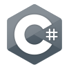
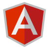

  

<h1 align="center">Saeed Ghofrani Ivari</h1>

<h3 align="center">Senior Backend Engineer and Engineering Manager</h3>

  I build backend systems, real-time platforms, and production infrastructure with a focus on reliability, performance, and clear business outcomes.

  <a href="https://saeedghofrani.xyz"><strong>Portfolio</strong></a>
  ·
  <a href="https://saeedghofrani.xyz/#recruiters"><strong>Recruiter Brief</strong></a>
  ·
  <a href="https://saeedghofrani.xyz/#case-studies"><strong>Case Studies</strong></a>
  ·
  <a href="https://saeedghofrani.xyz/#projects"><strong>Projects</strong></a>
  ·
  <a href="https://saeedghofrani.xyz/#contact"><strong>Contact</strong></a>

  
  &nbsp;&nbsp;
  
  &nbsp;&nbsp;
  
  &nbsp;&nbsp;
  

---

## Recruiter Signal

| Experience | Leadership | Reliability | Performance | Real-Time Scale |
| --- | --- | --- | --- | --- |
| 5+ years | Team of 8 | 99.9% uptime | 40% lower API latency | 500+ concurrent users |

I am strongest where product requirements meet production constraints: service boundaries, database design, queue-driven workflows, deployment, observability, and the engineering habits that keep teams shipping without breaking core business behavior.

## What I Build

| Area | What it means in practice |
| --- | --- |
| Backend platforms | NestJS, TypeScript, REST/GraphQL APIs, Prisma, TypeORM, service boundaries, authentication, operator workflows |
| Real-time systems | WebSockets, Socket.IO, WebRTC, RabbitMQ, event-driven flows, chat, VoIP, video sessions |
| Data and performance | PostgreSQL, MongoDB, Redis, Neo4j, query optimization, indexing, reporting, persistence design |
| Infrastructure | Docker, Kubernetes, Nginx, Linux servers, CI/CD, production deployment, uptime ownership |
| Engineering leadership | Delivery planning, mentoring, PR review, architecture review, technical documentation, hiring collaboration |

## Proof Map

| System | Backend value |
| --- | --- |
| **License Market Backend** | Production NestJS backend for operator workflows, ticketing, real-time AI chat, reporting, and integrations. Maintained 99.9% uptime, reduced API latency by 40%, and supported delivery with a backend team of 8 engineers. |
| **Mobasher Real-Time Consulting Platform** | Consulting, learning, chat, VoIP, video, Socket.IO, WebRTC, SQL optimization, and backend microservices for 500+ concurrent users. |
| **Crypto Exchange KYC and Persistence** | Financial backend systems with KYC/AML, exchange integrations, blockchain nodes, and PostgreSQL, MongoDB, Neo4j, Redis, and Elasticsearch. |
| **Portfolio Platform** | Full-stack personal platform with backend-managed content, case studies, recruiter paths, public pages, admin workflows, and VPS deployment. |
| **compare-guard** | Safe, chainable comparison helpers for direct values and nullable nested object paths in JavaScript and TypeScript projects. |
| **Object Creator** | Utility for creating nested JavaScript objects from string paths, with dynamic object structures and reusable object-modeling behavior. |

## Fast Review Paths

If you are reviewing my work, start here:

1. **5-minute scan:** [Recruiter brief](https://saeedghofrani.xyz/#recruiters) for role fit, metrics, and contact routes.
2. **Technical review:** [Architecture](https://saeedghofrani.xyz/#architecture) for system design and backend tradeoffs.
3. **Evidence review:** [Case studies](https://saeedghofrani.xyz/#case-studies) for constraints, implementation choices, and impact.
4. **Project review:** [Selected projects](https://saeedghofrani.xyz/#projects) and public GitHub repositories.
5. **Direct contact:** [Email](mailto:sa.ghofraniivari@gmail.com), [LinkedIn](https://www.linkedin.com/in/saeed-ghofrani-ivari/), or [Telegram](https://t.me/SaeedGhofraniIvari).

## Core Stack

  
  
  
  
  
  
  
  
  
  
  
  
  
  
  
  

**Backend:** Node.js, NestJS, TypeScript, Express.js, REST APIs, GraphQL, Microservices, Prisma, TypeORM 
**Data:** PostgreSQL, MongoDB, Redis, Neo4j, MySQL, SQLite, SQL Server, query optimization 
**Real-time:** RabbitMQ, WebSockets, Socket.IO, WebRTC, Firebase Realtime Database 
**Infrastructure:** Docker, Kubernetes, Nginx, Linux servers, CI/CD, object storage, VPS operations 
**Frontend:** Angular, React, Next.js, Vue.js, HTML, CSS, JavaScript, ASP.NET Core

## Current Focus

- Designing reliable backend systems with clear service boundaries.
- Improving PostgreSQL/API performance without changing business behavior.
- Building real-time features that stay maintainable after launch.
- Turning production experience into architecture notes and public case studies.

## GitHub Activity

  
  

  

  

---

  <strong>Open to backend, platform, real-time systems, and engineering leadership roles.</strong>
   
  <a href="mailto:sa.ghofraniivari@gmail.com">sa.ghofraniivari@gmail.com</a>
  ·
  <a href="https://saeedghofrani.xyz">saeedghofrani.xyz</a>

