

  <a href="https://saeedghofrani.xyz">
    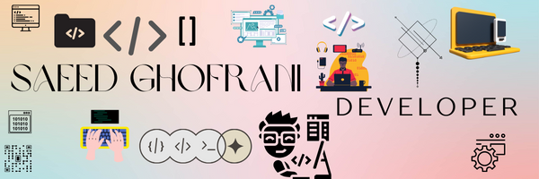
  </a>

<h1 align="center">Saeed Ghofrani Ivari</h1>

<h3 align="center">Engineering Manager / Senior Backend Engineer</h3>

  

  Adana, Turkey &nbsp;·&nbsp; Open to international and remote opportunities

  I build and operate backend systems for commerce, trading, payments, operator workflows, and real-time products. 
  My work spans architecture, implementation, code review, database performance, incident response, delivery, and engineering leadership.

  
  &nbsp;&nbsp;&nbsp;&nbsp;
  
  &nbsp;&nbsp;&nbsp;&nbsp;
  <a href="https://saeedghofrani.xyz">
    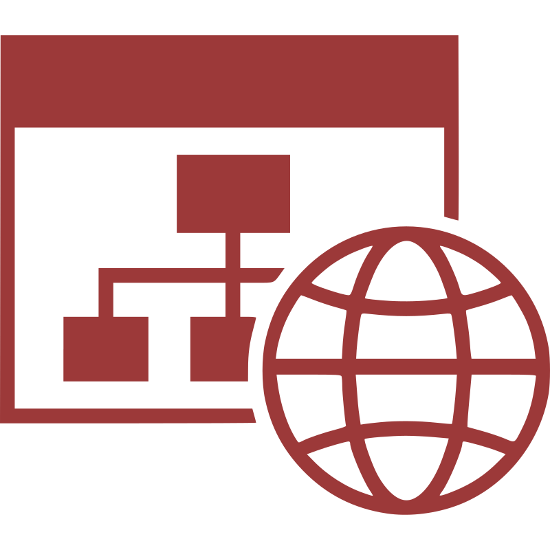
  </a>
  &nbsp;&nbsp;&nbsp;&nbsp;
  

  <a href="https://saeedghofrani.xyz"><strong>Portfolio</strong></a>
  &nbsp;|&nbsp;
  <a href="https://saeedghofrani.xyz/resume.pdf"><strong>Resume</strong></a>
  &nbsp;|&nbsp;
  <a href="https://saeedghofrani.xyz/projects"><strong>Projects</strong></a>
  &nbsp;|&nbsp;
  <a href="https://saeedghofrani.xyz/case-studies"><strong>Case Studies</strong></a>
  &nbsp;|&nbsp;
  <a href="https://saeedghofrani.xyz/architecture"><strong>Architecture</strong></a>

---

## Builder Manifest

I want my GitHub to feel like a workshop: a place where backend ideas become useful tools, resilient systems, and clear engineering patterns.

Some projects are production-grade. Some are focused public demonstrations. Some are private products described through architecture and case studies. Across all of them, I care about the same things:

- Build open-source tools that make backend development calmer and clearer.
- Create real-time systems that feel alive without becoming fragile.
- Turn production lessons into reusable architecture, libraries, and public writing.
- Keep learning in public, shipping in public, and improving the craft.

## What I Am Building Toward

| Direction | Why it matters |
| --- | --- |
| **Open-source backend tools** | Small, sharp utilities that remove repetitive backend work and improve developer experience. |
| **Real-time product infrastructure** | Chat, video, live workflows, queues, events, and systems that keep people connected. |
| **AI-assisted operator systems** | Human-controlled tools that help support, CRM, and business teams move faster. |
| **Database performance craft** | Better schemas, indexes, queries, and data flows for products that need to stay fast as they grow. |
| **Beautiful engineering documentation** | Architecture notes, tradeoffs, and case studies that make complex systems easier to understand. |

## My Engineering Taste

- APIs should feel predictable.
- Data models should explain the business.
- Background jobs should be observable.
- Real-time features should degrade gracefully.
- Developer tools should be boring to install and satisfying to use.
- Production code should respect the next engineer who has to debug it at 3 AM.

## Selected Public Work

| Project | Visibility | What it demonstrates |
| --- | --- | --- |
| [**compare-guard**](https://github.com/saeedghofrani/compare-guard) | Public open source | A zero-dependency TypeScript library for safe nested-path comparison, deep equality, validation helpers, and defensive property access. |
| [**rust-signalforge**](https://github.com/saeedghofrani/rust-signalforge) | Public open source | A compact Rust/Axum service with typed routes, separated domain logic, structured logging, health endpoints, and HTTP integration tests. |
| [**WebRTC client**](https://github.com/saeedghofrani/Webrtc-Client-React) and [**server**](https://github.com/saeedghofrani/webrtc-server) | Public demo | Browser real-time communication, signaling, room state, chat, and deployment work. |
| [**Portfolio Platform**](https://saeedghofrani.xyz/architecture) | Deployed; private source | A Next.js, NestJS, Prisma, PostgreSQL, Docker, and VPS platform documented through its public architecture and case studies. |

  <a href="https://github.com/saeedghofrani?tab=repositories"><strong>Browse the complete public repository archive →</strong></a>

## Proof From Production

| Signal | Evidence |
| --- | --- |
| **Engineering leadership** | Led a backend team of 8 and coordinated 5+ major releases for a commerce and operator platform. |
| **Reliability** | Maintained 99.9% uptime across production backend services. |
| **Performance** | Reduced average API latency by 40% through caching, bounded data access, and query-path improvements. |
| **Real-time scale** | Supported 500+ concurrent users with sub-200 ms interaction latency across chat, voice, video, and learning workflows. |
| **Financial systems** | Built trading, pricing, wallet, transaction, payment, KYC/AML, and verification workflows. |
| **Enterprise systems** | Delivered process, project, warehouse, finance, messaging, notification, and file workflows. |

Client and employer source code remains private. The portfolio case studies describe the work without exposing confidential implementation details.

## Tools I Reach For

<h3>Languages and Markup</h3>

  
  
  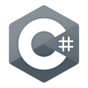
  
  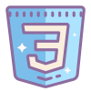
  
  
  
  
  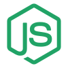
  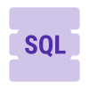
  

<h3>Frameworks, Libraries, and Product Surfaces</h3>

  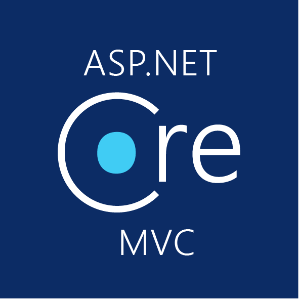
  
  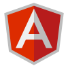
  
  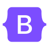
  
  
  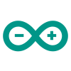
  
  

<h3>Databases, Infrastructure, and Collaboration</h3>

  
  
  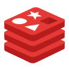
  
  
  
  
  
  
  
  

  
<strong>Focused stack summary</strong>

   

**Backend:** TypeScript, Node.js, NestJS, Express, REST, GraphQL, microservices, event-driven systems 
**Data and messaging:** PostgreSQL, MongoDB, Redis, RabbitMQ, Prisma, TypeORM, Elasticsearch, Neo4j 
**Real-time and platform:** WebSockets, Socket.IO, WebRTC, Docker, Kubernetes, Nginx, Linux, CI/CD 
**Additional:** Rust, Go, SQL, performance tuning, API security, observability, mentoring, system design

## Live Projects

| Project | Availability | Source visibility |
| --- | --- | --- |
| [**Portfolio**](https://saeedghofrani.xyz) | Live | Private |
| [**WebRTC meeting room**](https://meet.saeedghofrani.xyz) | Live | Public client and server repositories |
| [**Quit Together**](https://smoke.saeedghofrani.xyz) | Live | Private Go repository |
| [**Story Platform**](https://story.saeedghofrani.xyz) | Live | Private repository |

## Where To Start

1. Visit the [portfolio](https://saeedghofrani.xyz) for the complete professional overview.
2. Read the [case studies](https://saeedghofrani.xyz/case-studies) for production context and outcomes.
3. Review the [projects](https://saeedghofrani.xyz/projects) and [architecture](https://saeedghofrani.xyz/architecture) for implementation detail.
4. Download the current [résumé](https://saeedghofrani.xyz/resume.pdf).
5. Browse the [complete public repository archive](https://github.com/saeedghofrani?tab=repositories).

---

  <strong>Building open-source tools, resilient backend systems, and software that deserves to exist.</strong>
    
  <a href="mailto:sa.ghofraniivari@gmail.com">Email</a>
  &nbsp;|&nbsp;
  <a href="https://saeedghofrani.xyz">Portfolio</a>
  &nbsp;|&nbsp;
  <a href="https://saeedghofrani.xyz/resume.pdf">Resume</a>
  &nbsp;|&nbsp;
  <a href="https://github.com/saeedghofrani">GitHub</a>

