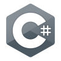

<svg fill="none" viewBox="0 0 600 300" width="600" height="300" xmlns="http://www.w3.org/2000/svg">
  <foreignObject width="100%" height="100%">
    

    
   

   

      
Saeed Ghofrani

   

   

   

   
   

   

   
   &#8287;&#8287;&#8287;&#8287;&#8287;
   
   &#8287;&#8287;&#8287;&#8287;&#8287;
   
   &#8287;&#8287;&#8287;&#8287;&#8287;
   
   &#8287;&#8287;&#8287;&#8287;&#8287;
   
   

    

### Aspiring Full-Stack Developer | Building the Future with Node js and Go

## About Me 🚀

---

Hey there! I'm a passionate developer with a background in C#, ASP.NET, Node.js, Angular and Nest.js and a strong desire to become a well-rounded full-stack developer. I'm currently diving into the exciting worlds of Go, Vue.js, Angular, React, and ASP.NET. Beyond coding, I'm fascinated by data science and love working with databases, writing complex SQL queries, and analyzing data. When I'm not coding, you'll find me lost in a good movie, jamming to music, or conquering video game challenges. I'm always eager to learn new things and collaborate on interesting projects. Let's connect!

   

         
   

## Technical Skills And Favorite Tools 🛠️

   <!-- Some badges are from https://github.com/Ileriayo/markdown-badges -->

   <h3>👨‍💻 Programming and Markup Languages</h3>

   

         
         
         
               
         
         
         
         
         
         
         
         
   

   <h3>🧰 Frameworks and Libraries</h3>

   

         
         
         
         
         
         
         
         
         
         
   

   <h3>🗄️ Databases and Cloud Hosting</h3>

   

         
         
         
         
         
         
         
         
         
         
         
   

   <!-- <h3>💻 Software and Tools</h3>

   

         
         
         
         
         
         
         
         
         
         
         
         
         
         
         
         
         
         
         
         
         
         
   
 -->

## My GitHub Stats 📊

---

   

   

   

      
   

   

      
   

   

      
   

   

      
   

   

  
   

   <!-- 

      
      
 -->

---

<a>

</a>

   

  </foreignObject>
</svg>

